<!-- docs made by D.Galloway 2019 - 2026 -->

# Adding Other AAPS Custom Watch Faces

  

### AAPS Watch Faces
• There are numerous watch faces to choose from that are integrated into the base build of the AAPS Full APK version. These watch faces include standard delta, IOB, currently active temp basal rate, basal profiles, and a CGM readings display.

### Changing to an AAPS Watchface on your WearOS Watch
• These are extra watch faces available in the normal build of the AAPS Wear OS APK build. After you have installed the AAPS Wear APK onto your watch, they will be obtainable. Here are the stages for selecting one for use: *(Remember you need two versions of the AAPS APK files: the Main one and the Wear one!)*

1. On your watch (WearOS), long press on your current watch face to bring up the watch face selector screen, and scroll to the right until you see the “Add Watch Face” button and select it.
   

     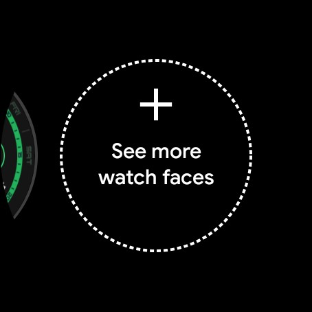
   

2. Scroll through the list until you see the “AAPS Watch Faces” section. Find “AAPS (Custom)” and click the center of the image to add it to your shortlist of current watch faces. Don’t be concerned about the appearance of the “AAPS (Custom)” watch face—we will choose your preferred watch face in the next step.
   

     
   

3. Select the watch faces to download that you would like to be able to use.

 

**Click on the images to Download Watchfaces**

| | | | |
| :---: | :---: | :---: | :---: |
| [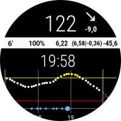 **AAPS**](../../../img/AAPS/watchfaces/AAPS.zip) | [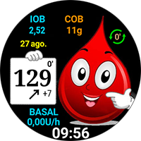 **Gota**](../../../img/AAPS/watchfaces/Gota_v2.4.zip) | [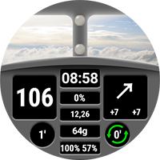 **Cockpit**](../../../img/AAPS/watchfaces/Cockpit.zip) | [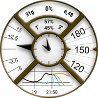 **SteamPunk**](../../../img/AAPS/watchfaces/SteamPunk.zip) |
| [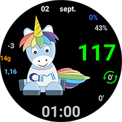 **AIMICO**](../../../img/AAPS/watchfaces/AIMICO-V1_1.zip) | [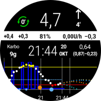 **AAPS_V2**](../../../img/AAPS/watchfaces/AAPS_V2.zip) | [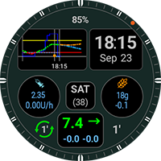 **Digital G-Watch**](../../../img/AAPS/watchfaces/Digital_G-Watch.zip) | [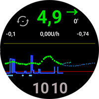 **SimpleDigital**](../../../img/AAPS/watchfaces/SimpleDigital_v1.3.zip) |
| [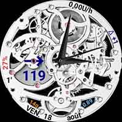 **Gears**](../../../img/AAPS/watchfaces/Gears.zip) | [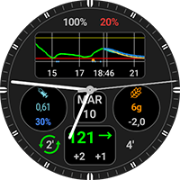 **Analog G-Watch**](../../../img/AAPS/watchfaces/Analog_G-Watch.zip) | [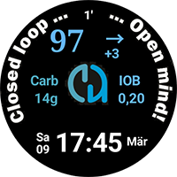 **LuckyLoopKoeln**](../../../img/AAPS/watchfaces/LuckyLoopKoeln.zip) | [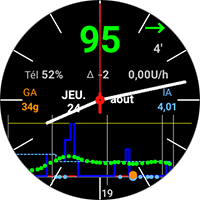 **Robby watchface**](../../../img/AAPS/watchfaces/Robby_watchface.zip) |
| [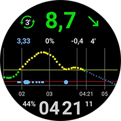 **DigitalBigGraph**](../../../img/AAPS/watchfaces/DigitalBigGraph_v1.5.zip) | [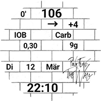 **PinkFloydTheWall**](../../../img/AAPS/watchfaces/PinkFloydTheWall.zip) | | |

 

4. Copy the downloaded watch face ZIP file over to your mobile phone into your `AAPS/Export` folder.
   

     
   

5. Open AAPS on your mobile and go to the **Wear** plugin section. *(If you don’t see it along the top, enable it in Config Builder under Synchronization plugins).*
   

     
     
   

6. Select the **“Load Watch face”** button and select the watch face file you downloaded.
   

     
   

7. Confirm on your watch that the “AAPS (Custom)” watch face is now displaying the watch face you selected.
8. Give it a few moments to refresh. You may customize complications by long-pressing the watch face and pressing the **“Customize”** Gear icon.

  

  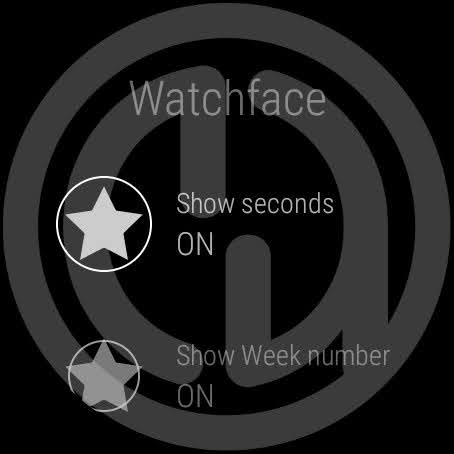
  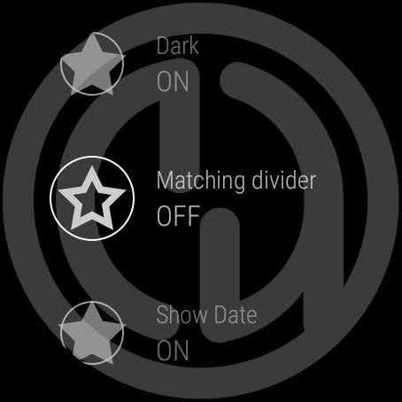
  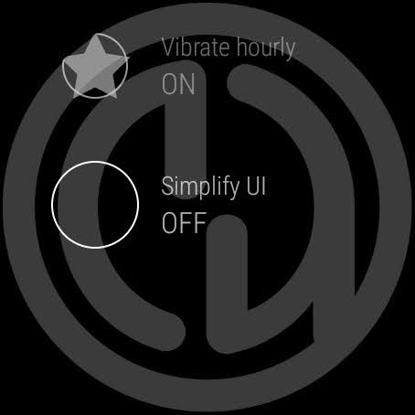

---

## 
All Finished! Enjoy Your New Faces

  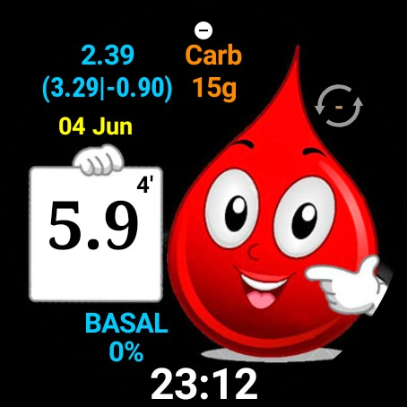

* If you would like to create your own watch faces, see this guide.
* Once you have made a custom watch face, you can share it with others! The ZIP file can be uploaded to the [ExchangeSiteCustomWatchfaces](https://github.com/openaps/AndroidAPSdocs/tree/master/docs/EN/ExchangeSiteCustomWatchfaces) folder via a Pull Request on GitHub.

 

 

[&emsp;&emsp;&emsp;&emsp;&emsp;&emsp;&emsp;&emsp;&emsp;]()
[Please Subscribe to our UTUBE Channel](https://www.youtube.com/channel/UC9TwtBefjjKw_uKHiIWMkBA?sub_confirmation=1){ .md-button }

 
<a href="https://maundyrelief.org.uk/" target="_blank">
  

</a>
 

 
Why Not take visit <a href="https://www.diabetes.org.uk/support-us/fundraise/fundraising-events/pedal-for-progress" target="_blank"> :man_biking_tone1: UK Wide Cycle Ride - Diabetes.uk :woman_biking_tone5:</a> **or** <a href="https://swim22.diabetes.org.uk/?fbclid=IwAR3XSygKTkbU7l_Xgu88WU3Q3EYFrFoAj1STvQTVz_6X-xthmjqOUWMTiww" target="_blank">Diabetes.UK Swim22 :man_swimming_tone5:</a> **or** <a href="https://www.diabetes.org.uk/support-us/fundraise/fundraising-events/60-miles-challenge" target="_blank">:man_walking_tone5: Diabetes UK Month of Miles Challenge :woman_running:</a> for all of your Diabetes Needs!