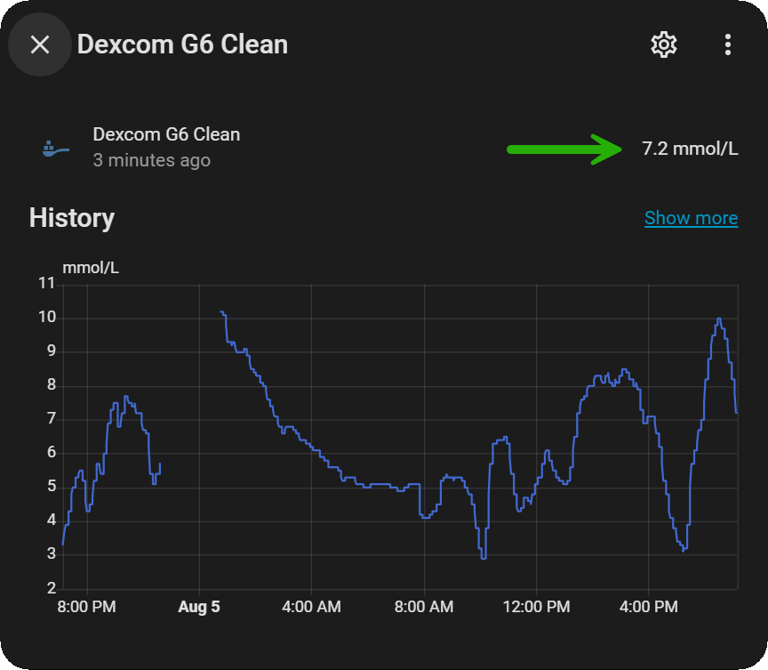

---
meta:
  - property: og:image
    content: "https://github.com/user-attachments/assets/e6c37552-5970-4f8e-a275-d4181575073f"
---
<!-- this is  on github server!
docs made by D.Galloway 2019- 2026-->

  &emsp;&emsp;
  &emsp;&emsp;
  

  <h1 style="text-align: center;"><strong>Dex Share Followers Setup Guide</strong></h1>

<h2 style="text-align: center;"><strong>Setting Up Dexcom Share (Required for Home Assistant)</strong></h2>

!!! note "Info"
    Dexcom Share Follower allows caregivers, family members, or healthcare providers to remotely monitor a Dexcom CGM user’s glucose data in real time via the Dexcom Follow app or website.

  Need a visual walkthrough? You can watch the official step-by-step guide video from Dexcom here:
  * <a href="https://www.youtube.com/watch?v=uRzaL7mfUck" target="_blank" title="Click to watch the Dexcom guide on YouTube">Dexcom G6 - Setting up Dexcom Share and Follow on YouTube</a>

   

## Step 1: Set Up Share in the Dexcom App

1. Open the Dexcom G6/G7 app  (if you do not already have it installed). <a href="https://play.google.com/store/apps/details?id=com.dexcom.g6.region1.mmol" target="_blank" title="Dexcom G6 mmol/L DXCM1">Dexcom G6/G7 app</a>

2. Tap the **Share** icon (the small sharing/network symbol) on the top right of your home screen.

3. Follow the on-screen instructions and informational prompts to enable Dexcom Share.

4. Choose the option to **Invite a Follower**.

5. Enter your email address (the same email or a secondary email address you can access).

6. Choose your follower permissions:
    * **View Only:** Can see glucose data.
    * **Manage Alerts:** Can adjust high/low alerts (if allowed).
7. Review and **send the invitation**.

### :fontawesome-solid-2: Follower Accepts the Invitation  

1. Check the email inbox. The follower will receive a message with a 'View Glucose Data' link.

2. Download the Dexcom Follow app  for (Android). (if you do not already have it installed). <a href="https://play.google.com/store/apps/details?id=com.dexcom.follow.region1.mmol" target="_blank" title="Dexcom Follow mmol/L DXCM1"> Dexcom Follow app</a>

3. Open the invitation email from Dexcom and click **Start Following** (or follow the link to download the Dexcom Follow app if prompted).

    * **Sharing with someone else:** They must accept the invitation using their own device and account.
    * **Following yourself:** If you are setting this up to follow your own data (e.g., for Home Assistant), accept the invitation yourself and log in using your usual Dexcom account credentials.

4. Accept the invitation inside the app to finalize the cloud link.

??? warning "Important: Match Your Email Address"
    You must log into the app using the **exact same email address** that the invite was sent to. If the emails do not match, the connection will fail.

!!! note "Note: Once this connection is active, Home Assistant will be able to securely log into your Dexcom account and pull your real-time numbers."

### :fontawesome-solid-3: Start Monitoring

* **What you or your followers can now view:**
    * Real-time glucose values
    * Trends (arrows)—**used in Home Assistant scripts and card readouts**
    * Custom alerts (if enabled)
* **Accessible via:**
    * Dexcom Follow app
    * <a href="https://clarity.dexcom.eu/" target="_blank" title="Dexcom Clarity">Dexcom Clarity Website</a> (for reports)

 

### :fontawesome-solid-4: Troubleshooting

!!! warning "Important Warning"
    Make sure your Dexcom account region (US vs. International) and active internet connection are correctly configured before troubleshooting connection errors.

* **Invite Not Received?**
    * Check spam/junk folders.
    * Resend the invite from the Dexcom app → Share menu.
* **"Connection Failed" or Login Error?**
    * Ensure the primary user’s phone has active internet (Share requires Wi-Fi or cellular data).
    * **Region Mismatch:** Make sure your Dexcom account region (US vs. International) matches your login settings.
* **Delay in Data / No Updates?**
    * Dexcom Share updates cloud servers every 5 minutes, so minor delays are normal.

  

 

### :bulb: :fontawesome-solid-5: Advanced Options

* **Multiple Followers:** 
    * You can share your real-time glucose data with **up to 10 people** simultaneously. This is great for family members, caregivers, or integrating multiple monitoring devices.
    * *For more details, check out the official <a href="https://www.dexcom.com/faqs/follow-app" target="_blank" title="Dexcom Follow FAQ">Dexcom Follow FAQ</a> page.*
* **Nightscout Integration:** 
    * You can forward your Dexcom cloud data to a personal Nightscout site for more customization, independent data history, and direct integration with local Home Assistant dashboards.
    * *To configure connection parameters like server region and sync intervals, review the <a href="https://nightscout.github.io/nightscout/setup_variables/" target="_blank" title="Nightscout Setup Documentation">Nightscout Setup Variables Guide</a>.*
* **Polling Intervals & Rate Limits:**
    * When setting up automations, be mindful of polling frequency. Dexcom's official cloud servers operate on a 5-minute update cycle, so setting automated queries too aggressively can trigger rate limits or account lockouts.

 

  <a href="https://www.youtube.com/channel/UC9TwtBefjjKw_uKHiIWMkBA?sub_confirmation=1" class="md-button" target="_blank" title="Subscribe to our YouTube Channel">Please Subscribe to our UTUBE Channel</a>

 

<a href="https://maundyrelief.org.uk/" target="_blank">
  

</a>
 

 
Why Not take visit <a href="https://www.diabetes.org.uk/support-us/fundraise/fundraising-events/pedal-for-progress" target="_blank"> :man_biking_tone1: UK Wide Cycle Ride - Diabetes.uk :woman_biking_tone5:</a> **or** <a href="https://swim22.diabetes.org.uk/?fbclid=IwAR3XSygKTkbU7l_Xgu88WU3Q3EYFrFoAj1STvQTVz_6X-xthmjqOUWMTiww" target="_blank">Diabetes.UK Swim22 :man_swimming_tone5:</a> **or** <a href="https://www.diabetes.org.uk/support-us/fundraise/fundraising-events/60-miles-challenge" target="_blank">:man_walking_tone5: Diabetes UK Month of Miles Challenge :woman_running:</a> for all of your Diabetes Needs!

<!--  
  ******************************************************************************************************************
  
  Facebook debugg

---
meta:
  - property: og:image
    content: "https://github.com/user-attachments/assets/7607c150-ee98-4f9b-97ff-abb894de6ba0"
---
  

---
meta:
  - property: og:image
    content: "https://github.com/user-attachments/assets/28413724-9144-4d82-8d46-7280865f2728"
---
  
  
  
  
  mkdocs.yml    # The configuration file.
    docs/
    index.md  # The documentation homepage.
       ...       # Other markdown pages, images and other files.
		
		*************************************************************************
		center text**
		## 
Now Do  
 
		
		*************************************************************
		
		
		
		

adding 	Green Hightligher!!!!!!!!	with bold too
**Choose Device**

adding 	Yellow Hightligher!!!!!!!!	with bold too
**Marked text**

white space:

&emsp;&emsp;&emsp;&emsp;&emsp;&emsp;&emsp;&emsp;&nbsp;&nbsp;&nbsp;&nbsp;&nbsp;&nbsp;&nbsp;&nbsp;&nbsp;&nbsp;

	

link
<a href=" https://github.com/" target="_blank" title="First create a user account by going to">Click Here</a>

Adding a image with link
 

***************************************************************************************************************

Link with image size and external link in new tab also as description in it too...

[{ width="300" }](https://github.com/Atlas-Night-Out/T1DDiabetesHACard-App/blob/main/Docs/dexcom_follower_setup.md){ target="_blank" }

{ width="300" }

[Download script file](scripts/S24 Announce T1D Glucose Trend From App Dexcom.md){ .md-button }

******************
extern just a link
***************
link
<a href=" https://github.com/" target="_blank" title="First create a user account by going to">Click Here</a>

<a href="https://www.mongodb.com/cloud/atlas" target="_blank" title="Click Try Free">See Here</a> 

********************************
link to another page!
*************************

****************
Relative Link:
*******************
[HardwareDataSource](xdrip%20-%20hardwaredatasource.md)
[HardwareDataSource](xdrip%20-%20hardwaredatasource.md)

[What is AAPS](../AndroidAPS/What%20is%20AAPS.md)

# 
Part 4: <a href="https://atlas-night-out.github.io/xdrip-Nightscout-AAPS/user-guide/Fork_and_Deploy_cgm_remote_monitory_part4/" target="_blank" title="Fork and Deploy cgm remote monitory Part 4">Fork and Deploy cgm remote monitory</a> 

********************************************************************************************
Adding Video
*******************************

## Visual Reference & Video Guide

Need a visual walkthrough? You can watch the official step-by-step guide video from Dexcom here:
* <a href="https://www.youtube.com/watch?v=uRzaL7mfUck" target="_blank" title="Click to watch the Dexcom guide on YouTube">Dexcom G6 - Setting up Dexcom Share and Follow on YouTube</a>

<iframe width="850" height="415" src="https://www.youtube.com/embed/MFsbm45b6YY" title="YouTube video player" frameborder="0" allow="accelerometer; autoplay; clipboard-write; encrypted-media; gyroscope; picture-in-picture" allowfullscreen></iframe>

Adding an embeded video
<iframe id="video3" width="560" height="315" src="https://www.youtube.com/embed/o7-T2IrDJ_A" title="YouTube video player" frameborder="0" allow="accelerometer; autoplay; clipboard-write; encrypted-media; gyroscope; picture-in-picture" allowfullscreen></iframe>

Video with image but this if a false Video!!!! And just and image with a link!

Note
**Note:** a note is something that needs to be mentioned but is apart from the context.

************************************************************************************************

Admonitions
*************************************

!!! note "Note: Once this connection is active, Home Assistant will be able to securely log into your Dexcom account and pull your real-time numbers."

This is a note with a drop down! you have to keep the format the same for it to work!!!!!!!!!!
??? info "Notes"

    Before proceeding, ensure that you've downloaded and installed all required applications on their respective devices. Once everything is set up, familiarize yourself with each app’s interface and functionality.   

!!! Warning "Important Notice - This Video is a Old Way Watch with Caution"

??? Warning "Important Note - This Video is a Old Way to do it! Watch with Caution"

    This Xdrip+ Install 2019 video installation process is  old now and the video really needed to be updated, which I done now. But will be leaving on the site for reference sake only  

??? info "Notes"

    This Xdrip+ Install 2019 video installation process is  old now and the video really needed to be updated, which I done now. But will be leaving on the site for reference sake only  

****************************************************************************************

List
This is a regular paragraph.

Paragraph:

1. **Now Open another tab**  to make a Mongodb Atlas** Account: <a href="https://www.mongodb.com/cloud/atlas" target="_blank" title="Click Start Free">See Here</a> 
  and **click** Start Free
 
   2. Sub item two
   3. Sub item three
2. Item two

font size

link
<a href=" https://github.com/" target="_blank" title="First create a user account by going to">Click Here</a>

Table
| Syntax | Description |
| ----------- | ----------- |
| Header | Title |
| Paragraph | Text |

Video in a box border!

<table width="1166" border="1" style="border-color: #000000; background-color: #ffffff;" cellpadding="1" cellspacing="1" height="98">
<tbody>
<tr style="height: 16px;">
<td style="width: 1158px; border-color: #000000; background-color: #5B9BD5;" fff="">video Instructions,</td>
</tr>
<tr style="height: 56.4063px;">
<td style="width: 1158px; border-color: #000000;">
 <iframe id="video3" width="860" height="515" src="https://www.youtube.com/embed/6o3AdkQBVog" title="YouTube video player" frameborder="0" allow="accelerometer; autoplay; clipboard-write; encrypted-media; gyroscope; picture-in-picture" allowfullscreen></iframe>  </td>
</tr>
</tbody>
</table>
*****************************************************
Warning Note<table width="1266" border="1" style="border-color: #000000; background-color: #ffffff;" cellpadding="1" cellspacing="1" height="98">
<tbody>
<tr style="height: 16px;">
<td style="width: 1158px; border-color: #000000; background-color: #FF0000;" fff=""><strong>Warning!</strong></td>
</tr>
<tr style="height: 56.4063px;">
<td style="width: 1158px; border-color: #000000;"> 1: Some new features, updates, or bug fixes may require that you clear your browser cache before you will see the changes taken effect  2: If you get no errors and no readings after a while see about doing a <a href="http://127.0.0.1:8000/user-guide/Redeploying%20your%20repository/" target="_blank" title="Redeploying your repository link">Redeploying your repository</a> </td>
</tr>
</tbody>
</table>

************************************************************************************
Subscribe
***************

new way with external link

  <a href="https://www.youtube.com/channel/UC9TwtBefjjKw_uKHiIWMkBA?sub_confirmation=1" class="md-button" target="_blank" title="Subscribe to our YouTube Channel">Please Subscribe to our UTUBE Channel</a>

 

old way

[&emsp;&emsp;&emsp;&emsp;&emsp;&emsp;&emsp;&emsp;&emsp;]()
[Please Subscribe to our UTUBE Channel](https://www.youtube.com/channel/UC9TwtBefjjKw_uKHiIWMkBA?sub_confirmation=1){ .md-button }

-->

