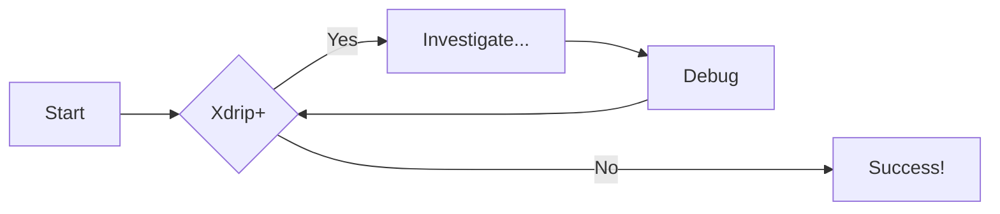
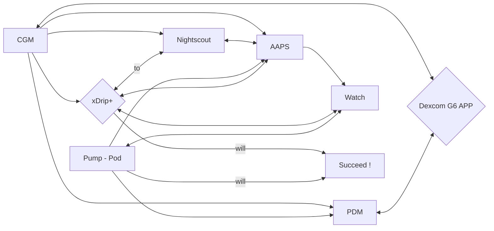
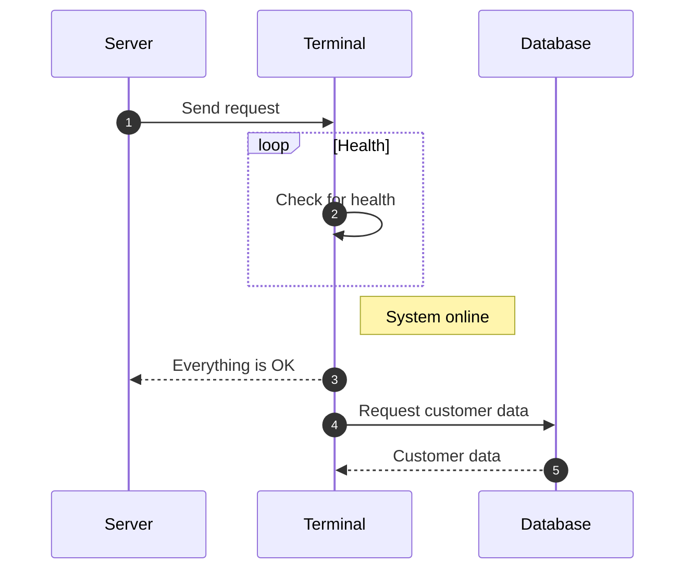

# CGM to Pump and watch Diagram Example

## Flowcharts

```mermaid
graph LR
  A[Start] --> B{Xdrip+};
  B -->|Yes| C[Investigate...];
  C --> D[Debug];
  D --> B;
  B ---->|No| E[Success!];
```

```mermaid
graph LR
  A[CGM] --> B{xDrip+};
  A[CGM] <--> I{Dexcom G6 APP};
  H[PDM] <--> I{Dexcom G6 APP};
  A[CGM] --> H{PDM};
  A[CGM] --> C[Nightscout];
  A[CGM] --> D[AAPS];
  B <-->|to| C[Nightscout];
  C <--> D[AAPS];
  F --> D[AAPS];
  D --> g[Watch];
  B <--> g[Watch];
  F <--> g[Watch];
  D <--> B;
  B ---->|will| E[Succeed !];
  F[Pump - Pod] ---->|will| E[Succeed !];
  F[Pump - Pod] ---->H[PDM];
  
```

## Sequence Diagrams

```mermaid
sequenceDiagram
  autonumber
  Server->>Terminal: Send request
  loop Health
      Terminal->>Terminal: Check for health
  end
  Note right of Terminal: System online
  Terminal-->>Server: Everything is OK
  Terminal->>Database: Request customer data
  Database-->>Terminal: Customer data
```