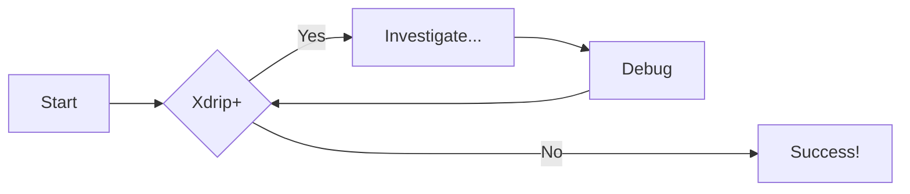
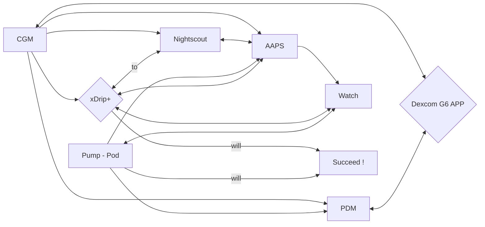
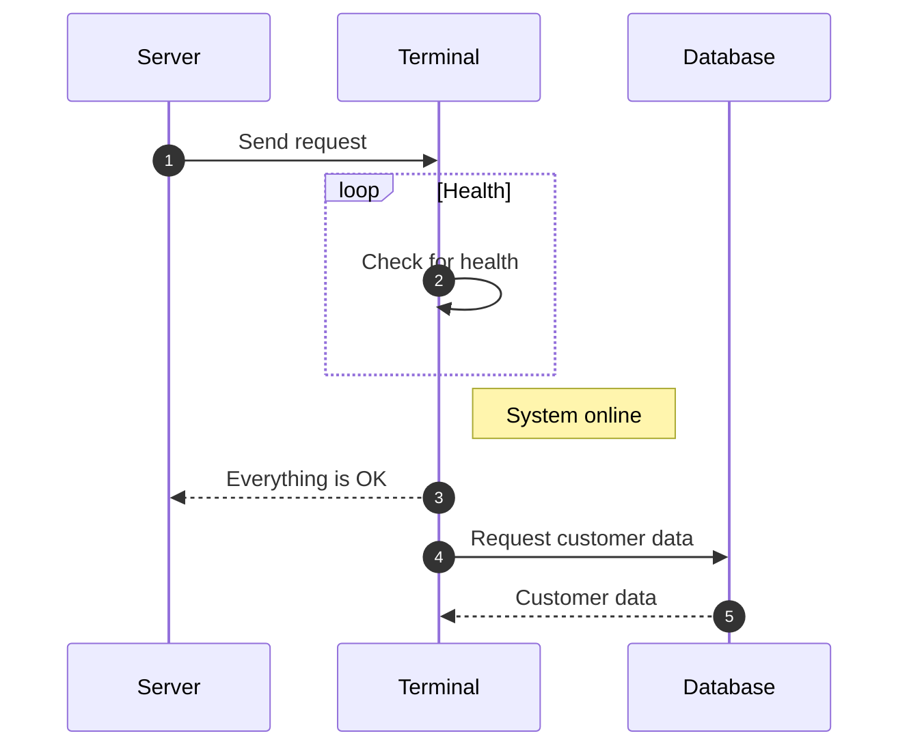
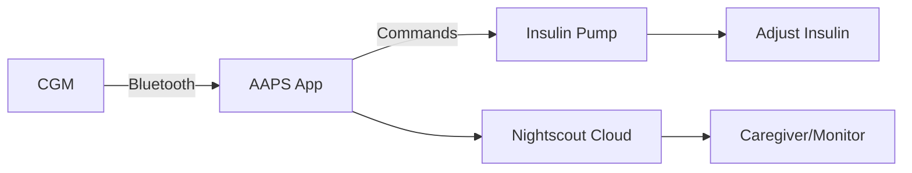

# CGM to Pump and watch Diagram Example

## Flowcharts







## Sequence Diagrams




=== "🔄 AAPS in Action"

=== "mermaid"
```js title="code-examples.md" linenums="1" hl_lines="2-4"
graph LR
  A[CGM] --> |Bluetooth| B[AAPS App];
  B -->|Commands| C[Insulin Pump];
  C --> D[Adjust Insulin];
  B --> E[Nightscout Cloud];
  E --> F[Caregiver/Monitor];
```


=== "mermaid"
```js title="code" 
graph LR
  A[CGM] --> |Bluetooth| B[AAPS App];
  B -->|Commands| C[Insulin Pump];
  C --> D[Adjust Insulin];
  B --> E[Nightscout Cloud];
  E --> F[Caregiver/Monitor];
```

=== "Sensor Applicator"

    </a>

=== "Sensor"

    </a>
    

=== "Transmitter "

    <center></a></center></a>

    ### Code Blocks in Content Tabs

=== "Display"

    </a>

=== "mermaid"
```js title="code" linenums="1" hl_lines="2-4"
graph LR
  A[CGM] --> |Bluetooth| B[AAPS App];
  B -->|Commands| C[Insulin Pump];
  C --> D[Adjust Insulin];
  B --> E[Nightscout Cloud];
  E --> F[Caregiver/Monitor];
```